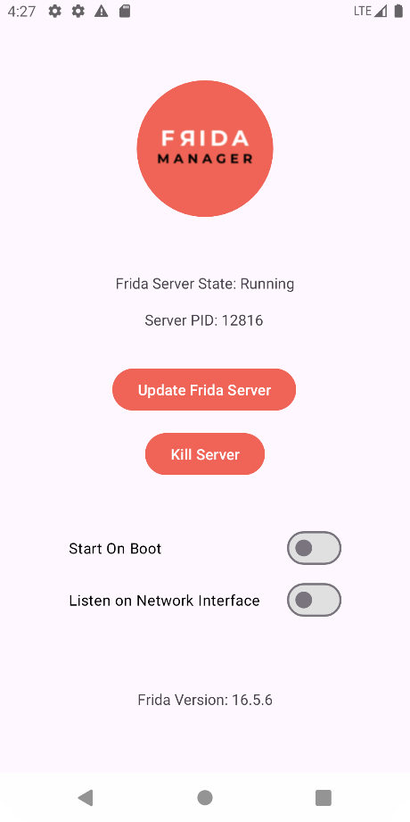

# Frida Manager

Frida Manager is an Android Application made to make the installation and management of the frida-server binary.

- [Functionality](#functionality)
- [How To Use](#how-to-use)
  - [USB](#usb)
  - [Remote](#remote)
- [Images](#images)
- [Tested Device](#tested-devices)
- [Common Errors](#common-errors)

## Functionality

- Installation and Updating of Frida Server
- Start server automatically on boot
- Listen on network interface
- Easily start/stop server from Quick Settings

## How To Use

Open the application and press the start server button (if the start button is not visible you need to install the server first), this will launch the Frida-Server on the device.
If your device is connected via USB then proceed [here](#usb). If you currently do not have a USB cable on you then you can enable [Network Mode](#remote).

### USB

If you've used Frida before then you'll be the most familiar with this method, the following test command should work as expected:
```bash
frida -U -f sh.damon.fridamgr
```
`-U` : stands for USB connected device, optionally if multiple devices are connected you may need to specify this with the `--device=` flag

### Remote

If you've enabled **Listen on Network Interface** in the FridaMgr app then you'll be able to connect to the Frida Server on the device remotely as long as you're within the same LAN.
```bash
frida -H 192.168.88.7:27055 -f sh.damon.fridamgr
```
`-H` : tells Frida that you want to connect to a network connected device.

## Images




## Tested Devices

The following list of physical and emulated devices have been tested and verified to be working.

### Physical
- Samsung Galaxy Z Fold3 (sdk33)
- One Plus 11 5G (sdk33)
- One Plus 6 (sdk30)

### Emulator
- Google Pixel 8 (sdk33)

## Common Errors

### need Gadget to attach on jailed Android; ...

Make sure the Frida Server is running in the FridaMgr application.

### unexpectedly timed out while waiting for signal from process with PID XXX

Try killing and starting the Frida-Server a few times, some devices make use of a process called USAP which allows applications to start up quicker.
However this interferes with Frida-Server being able to launch applications.

If the problem persist consider opening an issue with your device model and operating system version mentioned.